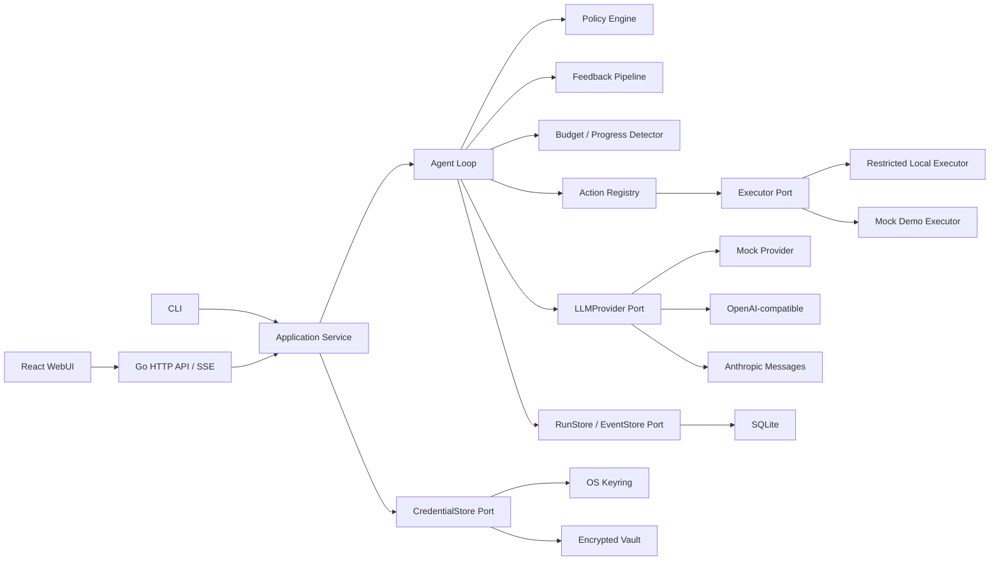

# AI4SE Coding Agent Harness — Design Specification

**Status:** Design approved on 2026-07-12  
**Repository:** `git@github.com:Liu-ty/ai4se_Coding_Agent_Harness.git`  
**Go module path:** `github.com/Liu-ty/ai4se_Coding_Agent_Harness`  
**Binary name:** `ai4se-harness`  
**Project configuration:** `.ai4se-harness.toml`

## 1. Problem Statement

Existing coding agents can edit files and run tests, but the engineering logic that answers “what failed, what changed, whether progress was made, and when completion is justified” is often delegated to the LLM itself. That makes completion claims difficult to test, audit, reproduce, and govern.

This project builds a language-agnostic coding agent harness whose central contribution is a deterministic feedback loop:

> Given a Git repository, a bounded coding task, and executable acceptance checks, the harness repeatedly applies governed code changes, classifies objective validation failures, feeds structured evidence back to the LLM, and stops only when every required check passes or an explicit budget/guardrail terminates the run.

### 1.1 Target Users

- Individual developers repairing a reproducible defect in a local repository.
- Maintainers implementing a small feature with explicit executable acceptance criteria.
- Security-conscious users who need selectable autonomy, reviewable diffs, and an auditable event trail.
- Instructors and reviewers who need to evaluate harness mechanisms without a real API key or network connection.

### 1.2 Why It Is Worth Building

The product is intentionally narrower than Codex, Claude Code, or OpenHands. Its value is not broad tool coverage; it is an inspectable and provider-neutral implementation of the mechanism that turns raw test output into bounded autonomous repair. A user can see why the system continued, why it stopped, and which objective evidence justified success.

## 2. Goals and Non-Goals

### 2.1 Course-Delivery Goals

1. Implement the agent loop without using an existing high-level agent runner.
2. Implement decision, tool, memory, governance, feedback, and configuration dimensions with runnable minimums.
3. Make the feedback dimension the deep primary contribution.
4. Keep every core mechanism deterministically testable with a mock LLM and no network.
5. Support Windows x64 and Linux x64 local execution.
6. Provide a local WebUI and CLI backed by the same application service.
7. Provide a public mock-only WebUI suitable for a 2-core, 2-GB Ubuntu server.
8. Distribute native binaries through GitHub Releases and a demo container through GHCR.
9. Store real provider credentials safely and never expose them to logs, child processes, Git, or the public demo.

### 2.2 Final Product Task Scope

The course-delivery product supports:

- Test-driven defect repair when at least one configured validation stage fails before modification.
- Small feature work only when the user supplies executable acceptance checks.
- Text-file changes within a single local Git repository.
- Ordered validation stages such as targeted tests, full tests, lint, type checking, and build.

### 2.3 First Runnable Increment

The first runnable increment supports one deterministic path only:

1. Reproduce one failing check.
2. Receive a mock LLM decision.
3. Apply a governed patch.
4. Run validation and inject/observe a failure.
5. Classify and feed back the failure.
6. Receive a different second decision.
7. Apply the corrected patch.
8. Pass validation and stop successfully.

### 2.4 Explicit Non-Goals for Course Delivery

- Arbitrary shell access.
- Automatic dependency installation.
- Untrusted-code isolation or public code execution.
- Automatic Git branch, commit, push, or pull-request operations.
- Multi-agent orchestration.
- Dynamic plugins or MCP.
- Long-term semantic memory or vector retrieval.
- IDE integration or an embedded code editor/terminal.
- Large migrations, deployment, production infrastructure, databases, or binary file modification.
- Token-level LLM streaming or vendor-native agent runners.

These are roadmap capabilities, not acceptance criteria.

## 3. User Stories

1. As a developer, I can configure language-agnostic validation commands so that the harness works without language-specific orchestration code.
2. As a developer, I can require the initial failure to be reproduced so that the harness does not “fix” an already passing repository.
3. As a developer, I receive categorized and compressed failure evidence so that the model is not overwhelmed by raw logs.
4. As a developer, a validation failure drives a subsequent, observably different action so that the feedback loop is real rather than a scripted success claim.
5. As a cautious user, I can select review, supervised, or workspace-auto mode so that autonomy matches my risk tolerance.
6. As an approver, I can inspect the exact action, affected files, risk reason, and action digest before approving it once.
7. As a maintainer, I can require a full final validation pipeline so that targeted success cannot hide regressions.
8. As a maintainer, I can inspect the event timeline, failure fingerprints, diffs, budgets, and stop reason so that I can audit or take over a run.
9. As a provider user, I can securely add, inspect the status of, update, and clear credentials without revealing the plaintext key.
10. As a reviewer, I can run a public mock scenario that proves governance interception, feedback injection, action change, and successful stopping without credentials.
11. As a Windows or Linux user, I can download a native binary and start the local UI without installing a language runtime.
12. As an operator, I can deploy the mock-only image on a small Ubuntu server without exposing a real executor or credential endpoint.

## 4. Functional Specification

### 4.1 Run Creation and Preflight

**Input**

- Absolute local repository path.
- Task description.
- Provider/model reference.
- Permission profile.
- Validation pipeline.
- Optional user-level budget overrides.

**Behavior**

1. Resolve and canonicalize the repository path.
2. Verify it is a Git worktree and record the baseline commit and diff.
3. Validate project configuration and platform-specific command variants.
4. Check that required executables exist.
5. Verify provider credential status without reading it into UI-visible state.
6. Enforce clean-worktree policy for `workspace-auto`.
7. Establish budgets and create an append-only initial event.
8. For `review`, enter a read-only analysis path without running baseline checks; for repair-capable profiles, proceed to baseline validation.

**Output**

- A run identifier and a preflight report.
- Either transition to baseline validation or a terminal/pending-approval state.

**Boundary and Errors**

- `workspace-auto` rejects a dirty worktree.
- `supervised` may accept a dirty worktree only after explicit approval and baseline capture.
- Missing Git, missing required executable, invalid configuration, unavailable credential storage, and non-repository paths are distinct errors.

### 4.2 Provider-Neutral Decision Protocol

Every provider implements the same `LLMProvider` port and returns one `AgentDecision` per request. A decision contains:

- Protocol version.
- Exactly one action and its typed arguments.
- A short expected outcome suitable for audit; hidden chain-of-thought is neither requested nor stored.

Supported adapters:

- Deterministic mock provider.
- OpenAI-compatible non-streaming provider.
- Anthropic Messages non-streaming provider.

The adapters normalize authentication, request/response shape, usage, errors, and rate limits. They do not expose vendor-native tool calls to the core. Invalid JSON or schema violations produce deterministic protocol feedback. A provider receives at most two immediate protocol-repair attempts for the same decision point before the run stops with `PROTOCOL_EXHAUSTED`.

### 4.3 Action and Tool System

The course-delivery action registry contains:

| Action | Input | Behavior | Output |
|---|---|---|---|
| `list_files` | repository-relative prefix/glob and result limit | Lists permitted files without following escaping links | Paths plus truncation metadata |
| `search_text` | literal/regular expression, allowed globs, result limit | Searches permitted UTF-8 text files | Matches with path and line evidence |
| `read_file` | path and bounded line/byte window | Reads a permitted UTF-8 file | Content, SHA-256, encoding, truncation metadata |
| `apply_patch` | unified diff plus per-file baseline hashes | Validates policy and applies all hunks atomically | Changed files, diff digest, or structured rejection |
| `create_file` | path and UTF-8 content | Creates a new permitted file without overwrite | New file hash and artifact metadata |
| `run_check` | configured check ID | Runs only the named command specification | Observation with exit, output, timing, and timeout state |
| `finish` | short completion summary | Triggers complete required validation, except in read-only review mode | Success/regression feedback, or `REVIEW_COMPLETE` |

Deletion, rename, overwrite-without-hash, raw shell, network tools, and Git writes are unknown/denied actions in the course-delivery registry.

### 4.4 Patch Application

Before applying a patch, the harness must:

1. Normalize each path and prove containment within the repository.
2. Reject `.git`, credential/vault paths, binary files, and symlink escape.
3. Compare current SHA-256 with the decision’s read baseline.
4. Enforce a default limit of five files and 500 changed lines per mutation cycle.
5. Preflight every hunk before applying any hunk.
6. Apply the patch atomically or leave all target files unchanged.

Git’s low-level patch checking/application may be used as a component, but policy, hashes, atomic orchestration, errors, and audit events belong to this project’s code.

### 4.5 Validation Pipeline

The project configuration declares ordered stages with these fields:

- Stable stage ID.
- `executable` and `args[]`; never a shell string.
- Repository-relative working directory.
- Windows and Linux overrides.
- Timeout and maximum stdout/stderr bytes.
- Required/optional flag.
- Stage kind: targeted-test, full-test, lint, typecheck, or build.
- Optional deterministic classification regular expressions.

Default ordering is:

`targeted-test → full-test → lint → typecheck/build`

Rules:

- Baseline validation must reproduce a failure.
- After every modifying action, the current failing stage runs automatically.
- A passed stage advances to the next configured stage.
- A failed stage immediately returns structured feedback to the decision loop.
- `finish` always reruns the complete required pipeline from the beginning.
- Success is impossible until every required stage passes in the final run.
- An initially passing pipeline yields `NO_REPRODUCTION`, not success.

### 4.6 Feedback Pipeline

The feedback pipeline is:

`Raw Observation → Normalizer → Classifiers → Deduplicator → Progress Detector → Compressor → Structured Feedback`

Feedback fields:

- Category and stage ID.
- Concise summary.
- Bounded evidence records.
- Exit code/timeout/cancellation state.
- Stable failure fingerprint.
- Retryable flag.
- Output-truncated flag.
- Previous occurrence count.

Required deterministic categories:

- Protocol: invalid JSON, unknown action, invalid arguments.
- Governance: denied, approval required, approval rejected.
- Patch: stale baseline, conflict, path denial, size limit, unsupported encoding.
- Environment: executable missing, spawn failure, timeout, cancellation, incomplete process cleanup.
- Validation: test assertion, compile, type, lint, build, generic nonzero exit.
- Progress: empty patch, repeated action, unchanged diff, repeated fingerprint, regression.

The normalizer removes ANSI sequences and unstable values such as timings, random identifiers, and addresses before fingerprinting. Raw output is redacted before persistence and clipped to configured limits. The LLM receives the compressed evidence, while the local user can inspect the complete redacted captured output.

### 4.7 Budgets and Stopping

Default limits:

- 30 model decisions.
- 5 modifying-action/validation cycles.
- 20 minutes wall-clock time.
- 2 immediate protocol-repair attempts per decision point.

A run stops for no progress when the same normalized failure fingerprint appears in two consecutive validation cycles and the corresponding diffs have no substantive change. A changed diff with the same failure is recorded as a warning, not an immediate stop.

Terminal outcomes include:

- `SUCCEEDED`
- `REVIEW_COMPLETE`
- `NO_REPRODUCTION`
- `BUDGET_EXHAUSTED`
- `NO_PROGRESS`
- `POLICY_DENIED`
- `USER_CANCELLED`
- `PROTOCOL_EXHAUSTED`
- `INFRASTRUCTURE_FAILED`

### 4.8 Permission Profiles and HITL

The policy engine produces `ALLOW`, `REQUIRE_APPROVAL`, or `DENY` for each canonical action.

| Profile | Reads/search | Mutations | Configured checks | Guarded actions |
|---|---|---|---|---|
| `review` | Allow | Deny and retain attempted patch as a non-applied proposal artifact | Deny | Deny |
| `supervised` | Allow | Require approval | Require approval | Require approval or deny |
| `workspace-auto` | Allow | Allow inside normal budgets | Allow | Require approval |

Hard denials cannot be overridden by a profile: repository escape, symlink escape, `.git` internals, credential access, arbitrary shell, unknown commands, network tools, binary writes, and key/endpoint mismatch.

An approval is bound to the canonical action, run ID, permission profile, and current file baselines by SHA-256. It approves one exact action once. The LLM cannot modify permissions. Repository configuration may tighten but never loosen user-level policy. Every policy result and permission change is an event.

### 4.9 Context and Run Memory

Course-delivery memory is scoped to one run:

- Task and acceptance pipeline.
- Repository baseline and current diff summary.
- Files explicitly read/searched and their hashes.
- Recent decisions/actions/observations.
- Structured failure history and fingerprints.
- Current stage, budgets, approvals, and stop warnings.

The context assembler selects bounded recent/high-signal records rather than loading full history. There is no cross-project user memory, vector store, or automatic semantic repository index in course delivery.

### 4.10 Credentials

Credential operations are: hidden add, status, update, and clear. Status never returns plaintext.

Storage priority:

1. Windows Credential Manager.
2. Linux Secret Service.
3. Master-password encrypted local vault when an OS keyring is unavailable.

The vault uses Argon2id with a random salt to derive a 256-bit key, then XChaCha20-Poly1305 with a random nonce for authenticated encryption. The master password and derived key are never persisted. Each credential is bound to provider and endpoint host. A custom endpoint requires explicit first-use confirmation. Credentials are not included in SQLite, logs, event payloads, child-process environments, project configuration, or the public demo.

### 4.11 Local API, CLI, and WebUI

The Go application exposes versioned `/api/v1` endpoints for runs, events, approvals, cancellation, configuration validation, artifacts, credential status/mutation, and demo scenarios. Server-Sent Events stream harness events, not LLM tokens.

Local mode:

- Listens on `127.0.0.1` only.
- Uses a random per-process session token.
- Validates Host and Origin, disables CORS, and protects mutations against CSRF.
- Serves the embedded React bundle.

Pages:

- Dashboard/recent runs.
- New Run/preflight.
- Run Detail with timeline, budgets, evidence, and diff.
- Approval view.
- Credentials.
- Demo Gallery.

The UI uses Open Design’s `dashboard` prototype skill and `linear-app` design system. The resulting nine-section `DESIGN.md` and tokens are committed to the repository; runtime does not depend on Open Design. The UI is keyboard-accessible, never relies on color alone, and labels public activity as `SIMULATED`.

### 4.12 Public Demo

The public profile is a separate composition root that registers only:

- Mock provider.
- Mock/in-memory executor.
- In-memory store.
- Fixed scenarios.
- Read/execute-demo API surface.

It does not register credential, filesystem, custom endpoint, repository upload, or process execution routes. Workspaces are in-memory and destroyed after each run. Rate, request-size, and concurrency limits apply.

## 5. Non-Functional Requirements

### 5.1 Security

- No real secret may enter source, Git history, configuration, logs, command output, or event payloads.
- Repository paths are canonicalized and checked after symlink resolution.
- Child processes do not receive LLM credentials or secret-like environment variables.
- Raw shell strings are not accepted.
- The public image contains no real executor or credential route.
- Dependency licenses and provenance are recorded in README.
- Secret scanning runs in CI.

### 5.2 Honest Threat Boundary

The restricted local executor trusts the user-selected repository and configured checks. Without a container, the harness cannot prevent a test executable from accessing the user’s network or files. `workspace-auto` is not a sandbox for malicious repositories. This limitation is shown in preflight, README, and the security section of the WebUI. Public demo mode never starts a real subprocess.

### 5.3 Reliability

- State transitions and event sequences are deterministic for mock inputs.
- SQLite writes use a single writer and transactionally update run snapshot plus event.
- One active run per repository.
- No automatic `git reset`, `git clean`, or discard operation.
- Patch application is all-or-nothing.
- Timeout cleanup failure is terminal and visible.

### 5.4 Performance and Resource Limits

- Public demo runs as one Go process on a 2-core, 2-GB Ubuntu server.
- Public demo performs no LLM request, persistent database write, or real child process execution.
- Local captured output and context are bounded by configuration.
- Initial WebUI bundle target is under 1.5 MiB compressed.
- API event latency target on localhost is below 250 ms excluding LLM/check execution.

### 5.5 Portability

- Release targets: Windows x64 and Linux x64.
- Process-tree control uses Windows Job Objects and Linux process groups.
- Paths, data directories, keyring backends, and command variants are platform adapters.
- Native users do not need Go or Node installed.

### 5.6 Usability and Accessibility

- First run guides the user through repository, checks, provider, credential, permission, and preflight.
- Every terminal state has a human-readable reason and next action.
- Approval views show exact scope and do not offer ambiguous permanent allow rules.
- Interactive controls are keyboard reachable and have accessible labels.

### 5.7 Observability and Privacy

- Every decision, policy result, tool action, validation result, feedback item, approval, budget change, and terminal transition is a typed event.
- Events are hash-chained to detect accidental alteration.
- SQLite contains only local, redacted operational data.
- Public demo retains no visitor run data after completion.

## 6. System Architecture

### 6.1 Architectural Rules

- Core packages import domain ports, not concrete adapters.
- Provider, tool, executor, storage, credential, clock, and event implementations are injected at the composition root.
- Local and public-demo builds use different composition roots and route registries.
- New tools cannot bypass policy or event emission.
- New feedback classifiers cannot mutate the workspace.
- WebUI and CLI call the same application use cases.
- Interfaces are introduced only where the delivery version has at least two implementations or a documented roadmap need.

### 6.2 Run State Machine

States:

Repair flow:

`CREATED → PREFLIGHT → BASELINE_VALIDATING → DECIDING → (AWAITING_APPROVAL | EXECUTING) → VALIDATING → FINAL_VALIDATING → SUCCEEDED`

Read-only review flow:

`CREATED → PREFLIGHT → DECIDING → EXECUTING(read/search) → DECIDING → REVIEW_COMPLETE`

Any active state may transition to an explicit stopped outcome. Reads/search return directly to `DECIDING`; mutations transition to `VALIDATING`; approval rejection either returns structured feedback or terminates according to the user choice.

## 7. Domain and Mechanism Design (Harness-Specific)

### 7.1 Coding-Domain Tools

The minimum coding tool surface is file discovery, text search, bounded file read, structured patch/create, configured validation, and finish request. These mechanisms are code-level dispatchers and adapters, not prompts.

### 7.2 Objective Feedback Signals

Primary signals are process exit outcome, validation stage identity, deterministic diagnostic extraction, patch application result, policy result, file/diff hashes, and budget/progress state. These signals are converted to typed feedback independently of a real LLM.

### 7.3 Dangerous Actions

Danger includes repository escape, symlink escape, protected or credential files, `.git` internals, large/sensitive patches, dirty-worktree mutation, unknown commands, raw shell, network tools, and credential/endpoint mismatch. The policy engine recognizes and maps them to allow/approval/deny in code.

### 7.4 Memory Needs

The loop needs task, baseline, explicit file context, action/observation history, current/final validation evidence, approvals, and budgets. It does not need full repository ingestion or cross-session semantic memory to prove the feedback contribution.

### 7.5 Primary Contribution

The feedback dimension is implemented deeply through:

- Ordered validation gates.
- Deterministic observation normalization.
- Failure taxonomy and configurable generic classification.
- Stable failure fingerprints.
- Deduplication and bounded evidence compression.
- Regression and no-progress detection.
- Automatic validation after mutations.
- Full final validation before success.
- Typed events that prove feedback affected subsequent decisions.

The hard test is satisfied: replacing every real provider with the mock still permits deterministic tests of dispatch, policy, approval, patching, feedback, memory, budget, and stopping.

## 8. Data Model

### 8.1 Entities

- `Run`: task, repository, state, provider reference, profile, stage, budgets, baseline, timestamps, terminal reason.
- `Budget`: decision, mutation, wall-clock, and protocol-retry limits/usages.
- `ValidationPipeline`: ordered stage definitions and platform overrides.
- `AgentDecision`: protocol version, one action, expected outcome.
- `Action`: type and typed canonical arguments.
- `ApprovalRequest`: action digest, risk, scope, status, user decision.
- `Observation`: tool/process result before feedback transformation.
- `StructuredFeedback`: category, summary, evidence, fingerprint, retryability, truncation, occurrence count.
- `RunEvent`: sequence, type, redacted payload, previous hash, current hash.
- `Artifact`: diff/output/final report metadata and content digest.
- `CredentialRef`: provider, endpoint host, backend, status, update time; never secret content.

### 8.2 SQLite Tables

- `runs`
- `run_events`
- `artifacts`
- `schema_migrations`

Run snapshot and appended event are committed in one transaction. Public demo substitutes an in-memory implementation.

## 9. Credential Threat Model and Countermeasures

| Threat | Countermeasure |
|---|---|
| Key committed to Git | No plaintext config field; secret scan; documented `.gitignore`; keyring/vault only |
| Key printed in logs/UI | Central redactor; status-only API; hidden inputs; test fixtures with canary secrets |
| Key inherited by test process | Sanitized child environment; provider calls remain in parent process |
| Key sent to malicious compatible endpoint | Credential bound to provider and normalized endpoint host; explicit first-use confirmation |
| Vault theft | Memory-hard KDF plus authenticated encryption; random salt/nonce; restrictive file permissions |
| Master password persistence | Hidden input; memory only; zero best-effort buffers after use |
| Public demo credential access | Credential subsystem and routes absent from demo composition root |
| Local web cross-origin attack | Loopback bind, per-process token, Host/Origin checks, no CORS, CSRF protection |

## 10. Distribution and Deployment

### 10.1 Native Distribution

GitHub Releases contains:

- `ai4se-harness_windows_amd64.exe`
- `ai4se-harness_linux_amd64`
- SHA-256 checksum manifest.
- Release notes and first-run instructions.

### 10.2 Container Distribution

GHCR contains a versioned mock-demo image built by a multi-stage Dockerfile. The final image:

- Runs as non-root.
- Uses a read-only root filesystem.
- Has no Docker socket, host repository, credential directory, or persistent volume.
- Uses tmpfs/in-memory workspaces.
- Exposes only the demo HTTP port.

### 10.3 Ubuntu Deployment

- Target: 2 CPU, 2 GB RAM Ubuntu server.
- Caddy terminates TLS for the configured domain.
- One demo container instance with CPU, memory, PID, and request limits.
- `/healthz` health check.
- Previous image tag retained for rollback.

## 11. Technology Choices

- **Backend/core:** Go 1.26.5 or later compatible patch release in the 1.26 line. Reason: small runtime, explicit interfaces, safe direct process APIs, cross-compilation, and single-binary embedding.
- **Module identity:** `github.com/Liu-ty/ai4se_Coding_Agent_Harness`, matching the user-created GitHub repository.
- **Frontend:** React 19.2 with TypeScript and Vite 8.1, built with Node 24 LTS. Reason: strong interactive timeline/diff ecosystem while remaining static at runtime.
- **HTTP/event transport:** Go standard HTTP server plus SSE. WebSocket is unnecessary for one-way run events.
- **Persistence:** SQLite behind `database/sql` using `modernc.org/sqlite`, preserving CGO-free Windows/Linux cross-compilation.
- **Configuration:** TOML with a versioned schema and strict unknown-field rejection.
- **Credentials:** `github.com/zalando/go-keyring` for Windows Credential Manager/Linux Secret Service, plus an Argon2id and XChaCha20-Poly1305 encrypted-vault fallback from `golang.org/x/crypto`.
- **Testing:** Go test/fuzzing, React component tests, and browser E2E tests.
- **Design:** Open Design `dashboard` skill and `linear-app` design system, materialized into repository-owned `DESIGN.md`.
- **CI/CD:** GitHub Actions. The required unit-test job is named `unit-test`; GitLab CI is not part of the confirmed requirement.

No high-level agent framework, agent runner, framework memory, or governance hook is used by the delivered harness core.

## 12. Acceptance Criteria

### 12.1 Core Loop

- A mock run can deterministically move from baseline failure through two different patch decisions to final success.
- A review run performs no check or mutation and terminates as `REVIEW_COMPLETE` with a non-applied proposal artifact.
- A run cannot succeed without a complete passing required pipeline.
- An initially passing baseline terminates as `NO_REPRODUCTION`.
- Budget and repeated-fingerprint stops are deterministic.

### 12.2 Governance

- The same action maps differently under review, supervised, and workspace-auto profiles.
- A dangerous action is intercepted before execution.
- An approval is invalid after any bound action/baseline/profile change.
- Hard-denied actions remain denied in every profile.

### 12.3 Feedback

- Mock/stub observations cover every required feedback category without network.
- Fingerprints remain stable across ANSI, timing, address, and random-ID differences.
- Secret canaries never appear in stored or returned output.
- A test proves the second model decision consumes first-round feedback and changes action.

### 12.4 Tools and Portability

- Patch conflict, stale baseline, path escape, symlink escape, protected path, binary, and size-limit cases are tested.
- Timeout kills a process tree on both Windows x64 and Linux x64 CI.
- Native binaries start without Go or Node installed.

### 12.5 Credentials

- Hidden add, status, update, and clear work for the selected backend.
- Status never returns plaintext.
- Linux keyring failure can fall back to an encrypted vault.
- Provider/endpoint mismatch blocks a request.

### 12.6 UI and Public Demo

- WebUI can create/observe/cancel a local run and handle an approval.
- Timeline exposes decision, policy, action, validation, feedback, budget, and terminal events.
- Public demo proves guardrail interception, injected failure, changed next action, and success.
- Public route discovery shows no credential, filesystem, custom endpoint, or real executor route.
- The configured domain serves the demo over HTTPS at submission time.

### 12.7 Delivery

- One command runs all required tests.
- GitHub Actions’ latest run passes, including a `unit-test` job.
- GitHub Release provides both native targets and checksums.
- GHCR provides the tagged demo image.
- README documents installation, running, directory structure, distribution, safe key setup, security boundaries, and known limitations.

## 13. Testing Strategy

- Pure domain unit tests for state machine, budget, policy, feedback, and stop conditions.
- Tool/security tests for paths, links, hashes, patches, approvals, redaction, and command selection.
- Provider contract tests against local HTTP fixtures only.
- Executor integration tests in temporary Git repositories.
- Mock-driven end-to-end feedback-loop tests.
- React component/API tests and browser E2E tests.
- Go fuzz targets for decision JSON, path normalization, output normalization, and patch headers.
- CI matrix on Windows and Ubuntu.

All implementation tasks follow red-green-refactor. No implementation code is written before `SPEC.md`, `PLAN.md`, and the required cold-start validation are accepted.

## 14. Risks and Fixed Decisions

| Risk | Decision/Mitigation |
|---|---|
| Scope expands toward a full commercial agent | Course acceptance table is the hard boundary; roadmap capabilities are excluded |
| Generic parsing is less precise than language-specific parsers | Deliver stable generic classification first; add classifiers through the feedback port later |
| Models fail the JSON/patch protocol | Typed schema, bounded repair attempts, stale/conflict feedback, mock contract tests |
| Local checks are malicious | Trust boundary disclosed; user config only; public demo never executes; Docker executor is future work |
| Cross-platform process behavior diverges | OS-specific process-controller adapters and CI tests |
| Keyring absent on headless Linux | Encrypted vault fallback |
| Public demo is mistaken for real execution | Mock-only composition root and persistent `SIMULATED` labeling |
| “Extensibility” becomes unused abstraction | Create interfaces only for delivered multiple adapters or a named roadmap seam |
| Agent edits tests to manufacture success | Test/CI/config paths are protected or require explicit approval; final diff remains visible |
| Course document conflict between GitHub/GitLab | User confirmed GitHub; implement GitHub Actions with job ID `unit-test` |

## 15. Evolution Roadmap

After course delivery, independent capabilities may be added in this order:

1. Docker sandbox executor.
2. Governed arbitrary shell and network policy.
3. Git branch/commit/PR tools.
4. Repository map, LSP, and AST tools.
5. Cross-session project memory.
6. Planner and task decomposition.
7. Dynamic tool/MCP plugins.
8. Worktree and multi-agent orchestration.
9. IDE and remote-execution integrations.

Each capability must enter through existing provider/tool/executor/context/policy/store ports and preserve the canonical feedback events and success criteria.
